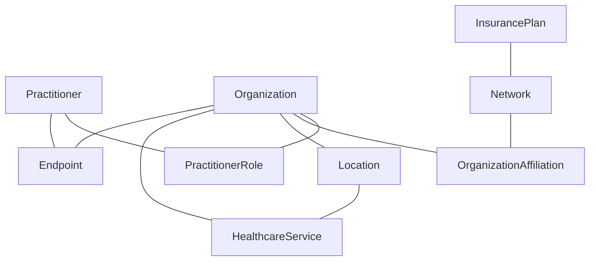

### Overview

This Implementation Guide defines a set of FHIR profiles for representing provider directory information in the Medicaid context. These profiles are based on the [Da Vinci Plan-Net Implementation Guide](http://hl7.org/fhir/us/davinci-pdex-plan-net/STU1.1/) [1] and the [FAST National Directory of Healthcare Providers & Services (NDH) Implementation Guide](http://hl7.org/fhir/us/ndh/STU1/) [2], but have been adapted to meet the specific requirements of Medicaid provider directories as defined in the Medicaid Information Technology Architecture (MITA) 3.0 [3] and the CMS Interoperability and Patient Access API Rule [4].

### Core Resources

The following core resources are used to represent the fundamental entities in a Medicaid provider directory:

#### Practitioner

The [Practitioner](StructureDefinition-medicaid-practitioner.html) resource represents an individual healthcare provider who delivers services to Medicaid beneficiaries. This includes physicians, nurses, therapists, and other healthcare professionals [5].

Key Medicaid-specific extensions and constraints include:
- **Medicaid Provider Identifier** - A unique identifier assigned by state Medicaid programs to individual providers, enabling consistent identification across Medicaid systems and supporting accurate provider matching, claims processing, and program integrity activities.
- **State license verification status** - Documentation of the verification process for professional licenses, including verification source, method, date, and outcome, creating a comprehensive audit trail that demonstrates due diligence in credential validation as required by Medicaid program integrity regulations.
- **Medicaid enrollment status and dates** - Structured representation of a provider's current enrollment status (e.g., active, suspended, terminated) and relevant dates (application, enrollment, termination), supporting accurate provider directory information and enabling historical tracking of provider participation.
- **Provider type codes specific to Medicaid** - Classification of providers according to Medicaid-specific taxonomies that may differ from standard industry codes, supporting state-specific provider categorization while maintaining mappings to national standards.

#### Organization

The [Organization](StructureDefinition-medicaid-organization.html) resource represents a group of people or entities that have come together to deliver healthcare services. This includes hospitals, clinics, group practices, and other healthcare organizations [5].

Key Medicaid-specific extensions and constraints include:
- **Medicaid Provider Identifier** - A unique identifier assigned by state Medicaid programs to organizational providers, enabling consistent identification across Medicaid systems and supporting accurate provider matching, claims processing, and program integrity activities.
- **Medicaid facility type codes** - Classification of healthcare facilities according to Medicaid-specific taxonomies, supporting state-specific facility categorization while maintaining mappings to standard CMS Place of Service codes for interoperability.
- **Medicaid enrollment status and dates** - Structured representation of an organization's current enrollment status and relevant dates, supporting accurate provider directory information and enabling historical tracking of organizational participation in Medicaid.
- **Ownership disclosure information** - Detailed documentation of ownership relationships and controlling interests as required by federal regulations (42 CFR 455.104) [6], including information about owners, relationships, and percentages of ownership to support program integrity and fraud prevention activities.

#### Location

The [Location](StructureDefinition-medicaid-location.html) resource represents a physical place where healthcare services are provided. This includes hospitals, clinics, offices, and other service delivery locations [5].

Key Medicaid-specific extensions and constraints include:
- **Accessibility information** - Detailed documentation of physical accessibility features for people with disabilities, including entrance accessibility, interior navigation, availability of accessible equipment, and communication accommodations, supporting beneficiaries in finding providers that meet their accessibility needs.
- **Public transportation access** - Information about public transportation options available at or near the service location, including bus routes, subway/train stations, and paratransit services, helping beneficiaries who rely on public transportation to access care.
- **Service area coverage** - Geographic areas served by the location, defined using geopolitical designations (counties, zip codes) or geometric boundaries, supporting network adequacy assessment and helping beneficiaries understand service availability in their area.
- **Medicaid-specific location type codes** - Classification of service locations according to Medicaid-specific taxonomies, supporting state-specific location categorization while maintaining mappings to standard codes for interoperability.

### Relationship Resources

The following resources are used to represent relationships between the core entities:

#### PractitionerRole

The [PractitionerRole](StructureDefinition-medicaid-practitioner-role.html) resource represents the relationship between a Practitioner and an Organization, including the roles, specialties, and services provided [5].

Key Medicaid-specific extensions and constraints include:
- **Medicaid specialty codes** - Detailed classification of provider specialties according to Medicaid-specific taxonomies, supporting state-specific specialty categorization while maintaining mappings to standard NUCC taxonomy codes for interoperability with other healthcare systems.
- **Panel status (open/closed to new Medicaid patients)** - Clear indication of whether a provider is accepting new Medicaid patients, including potential restrictions based on specific Medicaid programs or plans, helping beneficiaries identify providers who can accept them as new patients.
- **Medicaid service categories** - Structured representation of the specific services a provider is authorized to deliver under Medicaid, aligned with state-specific service categorization systems and benefit packages, supporting accurate service discovery and claims processing.
- **Cultural competency and language capabilities** - Comprehensive documentation of a provider's cultural competency training, language proficiency, and availability of interpretation services, supporting beneficiaries in finding providers who can meet their cultural and linguistic needs.

#### OrganizationAffiliation

The [OrganizationAffiliation](StructureDefinition-medicaid-organization-affiliation.html) resource represents relationships between organizations, including network participation and contractual relationships [5].

Key Medicaid-specific extensions and constraints include:
- **Medicaid managed care plan affiliations** - Detailed documentation of an organization's participation in Medicaid managed care plans, including the specific plans, networks, and programs, helping beneficiaries understand which providers are available through their managed care enrollment.
- **Medicaid contract types and status** - Structured representation of the contractual relationship between an organization and Medicaid, including contract type, effective dates, and status, supporting accurate provider directory information and program administration.
- **Service authorization requirements** - Information about prior authorization, referral, and other utilization management requirements that apply to services delivered through the affiliation, helping beneficiaries and referring providers understand how to access care.
- **Payment arrangements** - Details about reimbursement methodologies and financial arrangements between the organization and Medicaid, such as fee-for-service, capitation, or value-based payment models, supporting program administration and financial reporting.

#### Network

The [Network](StructureDefinition-medicaid-network.html) resource represents a collection of practitioners and organizations that provide healthcare services under a specific Medicaid program or managed care plan [5].

Key Medicaid-specific extensions and constraints include:
- **Medicaid program type (Traditional, Managed Care, Waiver)** - Classification of the network according to the Medicaid program structure it supports, such as traditional fee-for-service Medicaid, managed care programs, or specialized waiver programs, helping beneficiaries understand the context of provider participation.
- **Network adequacy metrics** - Quantitative measures of network sufficiency, including provider-to-beneficiary ratios, time/distance standards, and appointment availability metrics, supporting compliance with federal network adequacy requirements (42 CFR 438.68) [7] and helping beneficiaries understand access expectations.
- **Geographic coverage areas** - Detailed specification of the geographic regions covered by the network, defined using geopolitical designations (counties, zip codes) or geometric boundaries, supporting network adequacy assessment and helping beneficiaries understand service availability in their area.
- **Enrollment capacity** - Information about the network's capacity to accept new beneficiaries, including current enrollment, maximum capacity, and any enrollment limitations or waiting lists, supporting program planning and beneficiary choice.

### Supporting Resources

The following resources provide additional information to support the provider directory:

#### Endpoint

The [Endpoint](StructureDefinition-medicaid-endpoint.html) resource represents electronic service endpoints that can be used to exchange information with the provider or organization [5].

Key Medicaid-specific extensions and constraints include:
- **Medicaid electronic transaction capabilities** - Detailed documentation of the specific Medicaid-related electronic transactions supported by the endpoint, such as eligibility verification, claims submission, prior authorization requests, and electronic remittance advice, helping trading partners understand connectivity options.
- **Secure messaging capabilities** - Information about secure messaging protocols and capabilities, including Direct secure messaging addresses and other secure communication channels, supporting coordination of care and administrative communication.
- **Electronic service types relevant to Medicaid** - Classification of electronic services according to Medicaid-specific taxonomies, supporting state-specific electronic service categorization while maintaining mappings to standard codes for interoperability.
- **Connection requirements** - Technical specifications for establishing connections to the endpoint, including authentication methods, security protocols, and testing procedures, helping trading partners implement successful electronic exchanges.

#### HealthcareService

The [HealthcareService](StructureDefinition-medicaid-healthcare-service.html) resource represents services provided by practitioners and organizations [5].

Key Medicaid-specific extensions and constraints include:
- **Medicaid covered service categories** - Structured representation of the specific services covered under Medicaid, aligned with state-specific service categorization systems and benefit packages, supporting accurate service discovery and claims processing.
- **Service authorization requirements** - Detailed information about prior authorization, referral, and other utilization management requirements that apply to the service, including documentation requirements, submission processes, and review timeframes, helping beneficiaries and providers navigate access to care.
- **Eligibility criteria** - Specific Medicaid eligibility requirements for accessing the service, such as age restrictions, diagnosis requirements, or program-specific eligibility, helping beneficiaries understand service availability based on their specific coverage.
- **Referral requirements** - Information about whether referrals are required to access the service, including the types of referring providers accepted and any documentation requirements, supporting appropriate care coordination and service utilization.

#### InsurancePlan

The [InsurancePlan](StructureDefinition-medicaid-insurance-plan.html) resource represents Medicaid plans and programs [5].

Key Medicaid-specific extensions and constraints include:
- **Medicaid program type** - Classification of the insurance plan according to the Medicaid program structure, such as traditional fee-for-service Medicaid, managed care programs, or specialized waiver programs, helping beneficiaries understand their coverage context.
- **Eligibility criteria** - Comprehensive documentation of the specific eligibility requirements for the plan, including categorical eligibility, income thresholds, residency requirements, and other qualifying factors, helping potential beneficiaries understand their coverage options.
- **Enrollment processes** - Detailed information about how to enroll in the plan, including application methods, required documentation, enrollment periods, and assistance resources, supporting beneficiary access to coverage.
- **Coverage details** - Structured representation of the benefits covered under the plan, including service categories, limitations, cost-sharing requirements, and formulary information, helping beneficiaries understand their coverage and make informed healthcare decisions.

### Resource Relationships

The following diagram illustrates the relationships between the key resources in this Implementation Guide:

### Medicaid-Specific Extensions

This Implementation Guide defines several Medicaid-specific extensions to capture information that is not covered by the base FHIR resources [5], the Da Vinci Plan-Net profiles [1], or the FAST NDH profiles [2]:

#### Provider Extensions

- **medicaid-provider-identifier**: A unique identifier assigned to providers by a state Medicaid program, enabling consistent identification across Medicaid systems and supporting accurate provider matching, claims processing, and program integrity activities as required by state Medicaid provider enrollment processes.

- **medicaid-enrollment-status**: The current enrollment status of a provider in the Medicaid program, including statuses such as active, suspended, terminated, or pending, supporting accurate provider directory information and program administration in accordance with federal regulations (42 CFR 455.450) [8].

- **medicaid-enrollment-date**: The date when a provider was enrolled in the Medicaid program, supporting historical tracking of provider participation and enabling time-based queries about provider enrollment, which is essential for program integrity and reporting requirements.

- **medicaid-provider-type**: The type of provider as defined by the state Medicaid program, supporting state-specific provider categorization while maintaining mappings to standard NUCC taxonomy codes for interoperability with other healthcare systems.

#### Service Extensions

- **medicaid-service-category**: The category of service as defined by the state Medicaid program, aligned with state-specific service categorization systems and benefit packages, supporting accurate service discovery and claims processing in accordance with state Medicaid coverage policies.

- **medicaid-service-authorization**: Requirements for prior authorization of services, including documentation requirements, submission processes, and review timeframes, helping beneficiaries and providers navigate access to care and comply with utilization management policies.

- **medicaid-service-eligibility**: Eligibility criteria for receiving the service, such as age restrictions, diagnosis requirements, or program-specific eligibility, helping beneficiaries understand service availability based on their specific coverage and supporting appropriate service utilization.

#### Network Extensions

- **medicaid-network-type**: The type of Medicaid network (e.g., Fee-for-Service, Managed Care), supporting classification of networks according to the Medicaid program structure they support and helping beneficiaries understand the context of provider participation.

- **medicaid-network-adequacy**: Metrics related to network adequacy requirements, including provider-to-beneficiary ratios, time/distance standards, and appointment availability metrics, supporting compliance with federal network adequacy requirements (42 CFR 438.68) [7].

- **medicaid-service-area**: The geographic area covered by the network, defined using geopolitical designations (counties, zip codes) or geometric boundaries, supporting network adequacy assessment and helping beneficiaries understand service availability in their area.

### Alignment with FAST NDH

This Implementation Guide aligns with the FAST National Directory of Healthcare Providers & Services (NDH) Implementation Guide [2] in the following ways:

#### Shared Resources and Profiles

Where appropriate, this IG leverages profiles defined in the NDH IG, particularly for:

- **Verification and Validation**: Incorporating NDH verification extensions and patterns to support Medicaid provider verification processes, including attestation tracking, verification source documentation, and verification status representation, creating a comprehensive framework for ensuring provider information accuracy.

- **Accessibility Information**: Using NDH accessibility extensions to document provider accessibility features, including detailed physical accessibility characteristics, communication accommodations, and service delivery adaptations, supporting beneficiaries with disabilities in finding providers who can meet their accessibility needs.

- **Electronic Service Information**: Leveraging NDH endpoint profiles for electronic service information, including secure messaging capabilities, electronic transaction support, and technical connection specifications, enabling efficient electronic exchange of information between Medicaid systems and provider systems.

- **Healthcare Services**: Adopting NDH healthcare service patterns for describing Medicaid-covered services, including service categorization, availability, and delivery methods, supporting accurate representation of the healthcare services available to Medicaid beneficiaries.

#### Enhanced Search Capabilities

This IG incorporates the NDH search parameters and capabilities to enable more robust provider directory queries [9], including:

- **Geospatial search capabilities** - Advanced geographic search functionality that allows beneficiaries to find providers within a specified distance from a location, supporting accessibility of care and network adequacy assessment through precise location-based queries.

- **Advanced filtering by provider characteristics** - Sophisticated filtering mechanisms that enable searches based on multiple provider attributes simultaneously, such as specialty, languages spoken, accessibility features, and network participation, helping beneficiaries find providers who meet their specific needs.

- **Network and accessibility-based searches** - Specialized search capabilities focused on network participation and accessibility features, allowing beneficiaries to find providers who participate in their specific Medicaid plan and offer the accessibility accommodations they require.

#### Directory Validation

This IG adopts the NDH validation patterns to ensure data quality and currency [9], including:

- **Attestation tracking** - Systematic documentation of provider attestations regarding the accuracy of their information, including attestation dates, methods, and the specific information confirmed, creating an audit trail of provider-confirmed data.

- **Last verification date tracking** - Consistent recording of when each data element was last verified, enabling identification of potentially outdated information and supporting data currency monitoring and improvement initiatives.

- **Data source documentation** - Comprehensive tracking of the source of each data element, including whether it came from primary sources (e.g., provider self-reporting) or secondary sources (e.g., credentialing organizations), supporting data provenance and quality assessment.

### Value Sets

This Implementation Guide defines several value sets to support the Medicaid-specific aspects of provider directories:

- **MedicaidProviderTypeVS**: Types of providers recognized by Medicaid programs, including NUCC Provider Taxonomy codes [10], creating a comprehensive classification system that supports both state-specific provider categorization and interoperability with national standards through defined mappings.

- **MedicaidEnrollmentStatusVS**: Possible enrollment statuses for Medicaid providers, such as active, suspended, terminated, or pending, supporting accurate representation of provider participation status in accordance with federal regulations governing provider enrollment and program integrity (42 CFR 455) [8].

- **MedicaidServiceCategoryVS**: Categories of services covered by Medicaid, aligned with state-specific service categorization systems and benefit packages, supporting accurate service discovery and claims processing in accordance with state Medicaid coverage policies.

- **MedicaidNetworkTypeVS**: Types of Medicaid networks, such as fee-for-service, primary care case management, or managed care, supporting classification of networks according to the Medicaid program structure they support and helping beneficiaries understand the context of provider participation.

- **MedicaidFacilityTypeVS**: Types of facilities recognized by Medicaid programs, including CMS Place of Service codes [11], creating a comprehensive classification system that supports both state-specific facility categorization and interoperability with national standards through defined mappings.

#### External Code Systems

In addition to Medicaid-specific code systems, this Implementation Guide leverages established external code systems:

- **NUCC Provider Taxonomy**: Standard provider specialty codes from the National Uniform Claim Committee [10], providing a nationally recognized classification system for healthcare providers that supports interoperability with other healthcare systems and alignment with claims processing standards.

- **CMS Place of Service Codes**: Standard facility type codes from the Centers for Medicare & Medicaid Services [11], providing a nationally recognized classification system for healthcare service locations that supports interoperability with Medicare systems and other healthcare entities.

- **HCPCS**: Healthcare Common Procedure Coding System [12] for service categories, providing a standardized coding system for healthcare procedures, supplies, and services that supports alignment with claims processing and benefits administration.

### Concept Maps

This Implementation Guide provides concept maps to facilitate interoperability between Medicaid-specific codes and industry-standard codes:

- **MedicaidToNUCCProviderTypeMap**: Maps Medicaid provider types to NUCC Provider Taxonomy codes [10], enabling translation between state-specific provider classifications and nationally recognized taxonomy codes, supporting interoperability with other healthcare systems while preserving state-specific categorization.

- **MedicaidToCMSFacilityTypeMap**: Maps Medicaid facility types to CMS Place of Service codes [11], enabling translation between state-specific facility classifications and nationally recognized place of service codes, supporting interoperability with Medicare systems and other healthcare entities while preserving state-specific categorization.

### Search Parameters

This Implementation Guide defines several search parameters to support finding providers based on Medicaid-specific criteria:

- **medicaid-provider-id**: Search for providers by their Medicaid Provider Identifier, enabling precise identification of specific providers within the Medicaid system and supporting administrative functions such as provider lookup for claims processing, prior authorization, and program integrity activities.

- **medicaid-enrollment-status**: Search for providers by their Medicaid enrollment status, allowing users to filter providers based on their current participation status (e.g., active, suspended, terminated), supporting accurate provider directory information and program administration.

- **medicaid-provider-type**: Search for providers by their Medicaid provider type, enabling users to find providers of specific types as defined by the state Medicaid program, supporting beneficiary service discovery and program administration.

- **medicaid-facility-type**: Search for organizations by their Medicaid facility type, enabling users to find specific types of healthcare facilities as defined by the state Medicaid program, supporting beneficiary service discovery and program administration.

- **medicaid-network-type**: Search for providers by the type of Medicaid network they participate in, allowing users to filter providers based on their participation in specific Medicaid program structures (e.g., fee-for-service, managed care), supporting beneficiary choice and network management.

- **accepting-new-patients**: Search for providers who are accepting new Medicaid patients, enabling beneficiaries to find providers who can accept them as new patients, supporting access to care and network adequacy assessment.

### References

1. HL7 International. (2021). *Da Vinci Payer Data Exchange (PDex) Plan Network Directory Implementation Guide*. Retrieved from http://hl7.org/fhir/us/davinci-pdex-plan-net/STU1.1/

2. HL7 International. (2022). *FAST National Directory of Healthcare Providers & Services (NDH) Implementation Guide*. Retrieved from http://hl7.org/fhir/us/ndh/STU1/

3. Centers for Medicare & Medicaid Services. (2012). *Medicaid Information Technology Architecture (MITA) 3.0*. Retrieved from https://www.medicaid.gov/medicaid/data-systems/medicaid-information-technology-architecture/index.html

4. Centers for Medicare & Medicaid Services. (2020). *Interoperability and Patient Access Final Rule*. Retrieved from https://www.cms.gov/Regulations-and-Guidance/Guidance/Interoperability/index

5. HL7 International. (2022). *FHIR R4 Resource Specifications*. Retrieved from http://hl7.org/fhir/R4/resourcelist.html

6. Code of Federal Regulations. (2023). *42 CFR 455.104 - Disclosure of ownership and control*. Retrieved from https://www.ecfr.gov/current/title-42/chapter-IV/subchapter-C/part-455/subpart-B/section-455.104

7. Code of Federal Regulations. (2023). *42 CFR 438.68 - Network adequacy standards*. Retrieved from https://www.ecfr.gov/current/title-42/chapter-IV/subchapter-C/part-438/subpart-B/section-438.68

8. Code of Federal Regulations. (2023). *42 CFR 455.450 - Screening levels for Medicaid providers*. Retrieved from https://www.ecfr.gov/current/title-42/chapter-IV/subchapter-C/part-455/subpart-E/section-455.450

9. HL7 International. (2022). *FHIR R4 Search Framework*. Retrieved from http://hl7.org/fhir/R4/search.html

10. National Uniform Claim Committee. (2023). *Health Care Provider Taxonomy Code Set*. Retrieved from https://www.nucc.org/index.php/code-sets-mainmenu-41/provider-taxonomy-mainmenu-40

11. Centers for Medicare & Medicaid Services. (2023). *Place of Service Codes for Professional Claims*. Retrieved from https://www.cms.gov/Medicare/Coding/place-of-service-codes

12. Centers for Medicare & Medicaid Services. (2023). *Healthcare Common Procedure Coding System (HCPCS)*. Retrieved from https://www.cms.gov/Medicare/Coding/MedHCPCSGenInfo
