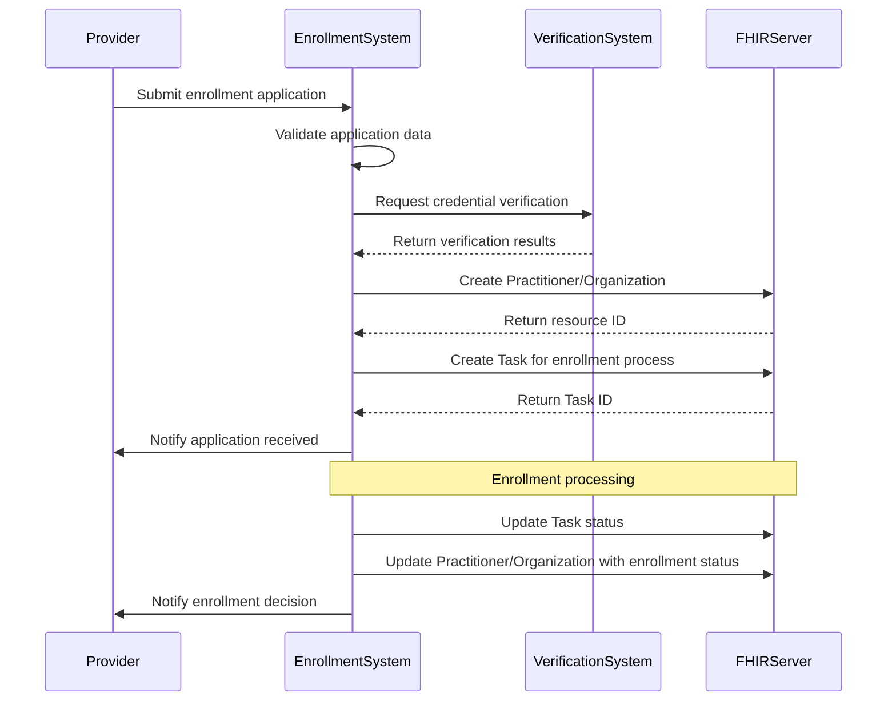
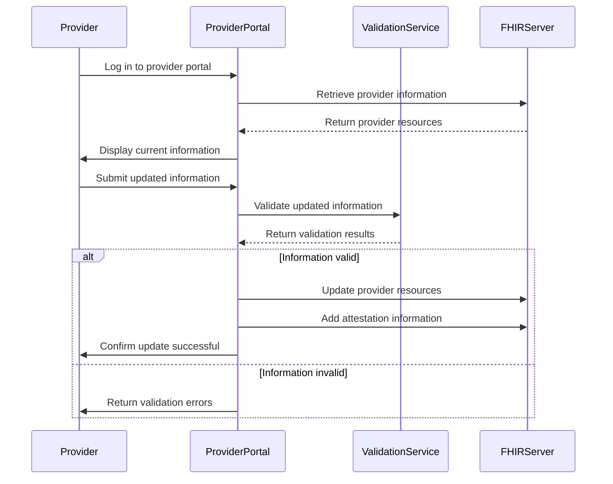
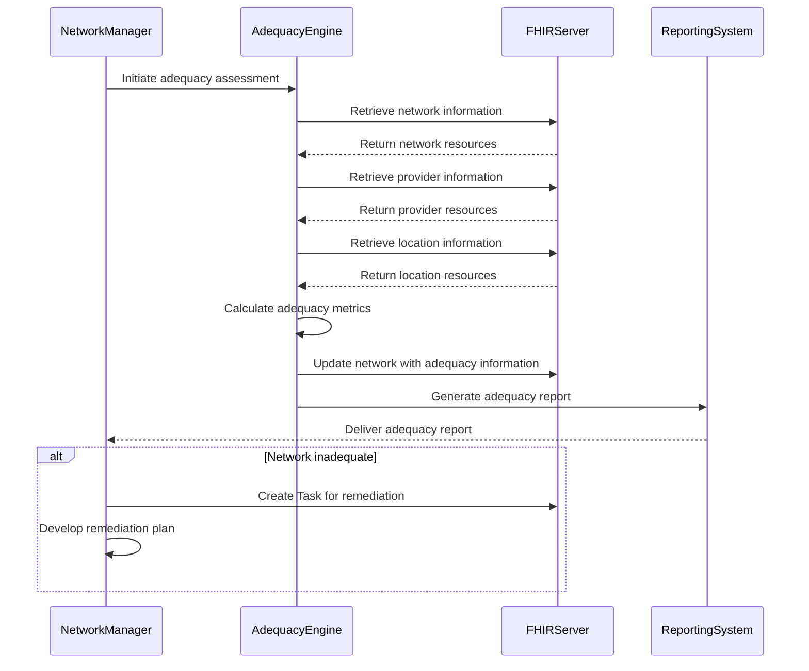

# MITA Implementation Guidance

## Overview

This Implementation Guide (IG) provides guidance for implementing provider directory functionality in alignment with the Medicaid Information Technology Architecture (MITA) 3.0 business processes. This guidance is intended to help state Medicaid agencies and their technology partners implement FHIR-based provider directories that support MITA business processes while meeting federal requirements for interoperability.

## MITA Business Processes

The MITA framework defines several business processes related to provider management. This IG focuses on the following key business processes:

### PM01 - Provider Enrollment

The Provider Enrollment business process encompasses the activities of enrolling providers to deliver services to Medicaid members. This includes:

- Receiving and processing provider applications
- Validating provider credentials
- Assigning provider identifiers
- Executing provider agreements
- Notifying providers of enrollment decisions

#### FHIR Resources for Provider Enrollment

The following FHIR resources support the Provider Enrollment business process:

| MITA Data Concept | FHIR Resource | Profile | Notes |
|-------------------|---------------|---------|-------|
| Provider Application | Task | | Use Task to track the enrollment application process |
| Provider Demographics | Practitioner, Organization | MedicaidPractitioner, MedicaidOrganization | Basic demographic information about the provider |
| Provider Credentials | Practitioner.qualification | MedicaidPractitioner | Credentials and qualifications of individual providers |
| Provider Identifier | Identifier | | Identifiers assigned to providers, including the MedicaidProviderIdentifier extension |
| Provider Agreement | Contract | | Use Contract to represent the agreement between the provider and Medicaid |
| Enrollment Status | Extension | MedicaidEnrollmentStatus | Status of the provider's enrollment |
| Enrollment Date | Extension | MedicaidEnrollmentDate | Date of the provider's enrollment |

#### Implementation Guidance for Provider Enrollment

1. **Application Tracking**:
   - Use Task resources to track the progress of provider enrollment applications
   - Define task statuses that align with your state's enrollment workflow
   - Link tasks to the relevant provider resources (Practitioner, Organization)

2. **Provider Demographics**:
   - Use MedicaidPractitioner and MedicaidOrganization profiles to capture provider demographics
   - Ensure all required data elements are collected during the enrollment process
   - Validate addresses and other contact information

3. **Credential Verification**:
   - Use Practitioner.qualification to capture credential information
   - Document the verification process using the VerificationInformation extension
   - Link to external credential verification systems where possible

4. **Provider Agreements**:
   - Use Contract resources to represent provider agreements
   - Link contracts to the relevant provider resources
   - Include key terms and conditions in the contract

5. **Enrollment Status Management**:
   - Use the MedicaidEnrollmentStatus extension to track enrollment status
   - Implement workflows for status changes (e.g., pending to active, active to suspended)
   - Ensure status changes are properly documented and communicated

### PM02 - Provider Information Management

The Provider Information Management business process encompasses the activities of maintaining accurate provider information. This includes:

- Updating provider demographics
- Managing provider credentials
- Tracking provider relationships
- Maintaining provider service information
- Handling provider status changes

#### FHIR Resources for Provider Information Management

The following FHIR resources support the Provider Information Management business process:

| MITA Data Concept | FHIR Resource | Profile | Notes |
|-------------------|---------------|---------|-------|
| Provider Demographics | Practitioner, Organization | MedicaidPractitioner, MedicaidOrganization | Basic demographic information about the provider |
| Provider Credentials | Practitioner.qualification | MedicaidPractitioner | Credentials and qualifications of individual providers |
| Provider Relationships | PractitionerRole, OrganizationAffiliation | MedicaidPractitionerRole, MedicaidOrganizationAffiliation | Relationships between providers and organizations |
| Provider Services | HealthcareService | MedicaidHealthcareService | Services offered by the provider |
| Provider Locations | Location | MedicaidLocation | Locations where services are provided |
| Provider Status | active flag, Extension | MedicaidEnrollmentStatus | Status of the provider |

#### Implementation Guidance for Provider Information Management

1. **Information Update Workflows**:
   - Implement workflows for providers to update their information
   - Use the AttestationInformation extension to document provider attestation
   - Implement validation checks for updated information

2. **Credential Management**:
   - Implement processes for tracking credential expiration
   - Send notifications for upcoming credential expirations
   - Document credential verification using the VerificationInformation extension

3. **Relationship Management**:
   - Use MedicaidPractitionerRole and MedicaidOrganizationAffiliation to manage relationships
   - Ensure relationships have appropriate start and end dates
   - Validate that relationships are consistent (e.g., a practitioner cannot be affiliated with an inactive organization)

4. **Service Information Management**:
   - Use MedicaidHealthcareService to manage service information
   - Link services to the appropriate locations and providers
   - Ensure service information is up-to-date and accurate

5. **Location Management**:
   - Use MedicaidLocation to manage provider locations
   - Validate addresses and other location information
   - Link locations to the appropriate organizations and services

6. **Status Management**:
   - Implement workflows for status changes
   - Ensure status changes are properly documented and communicated
   - Update related resources when a provider's status changes

### PM08 - Provider Network Management

The Provider Network Management business process encompasses the activities of developing and maintaining the provider network. This includes:

- Managing network composition
- Assessing network adequacy
- Monitoring network performance
- Managing provider contracts
- Handling network changes

#### FHIR Resources for Provider Network Management

The following FHIR resources support the Provider Network Management business process:

| MITA Data Concept | FHIR Resource | Profile | Notes |
|-------------------|---------------|---------|-------|
| Network | Organization | MedicaidNetwork | Represents a provider network |
| Network Composition | OrganizationAffiliation | MedicaidOrganizationAffiliation | Affiliations between providers and networks |
| Network Adequacy | Extension | MedicaidNetworkAdequacy | Metrics related to network adequacy |
| Network Type | Extension | MedicaidNetworkType | Type of network (e.g., managed care, fee-for-service) |
| Service Area | Extension | MedicaidServiceArea | Geographic area covered by the network |
| Provider Contracts | Contract | | Contracts between providers and networks |

#### Implementation Guidance for Provider Network Management

1. **Network Definition**:
   - Use MedicaidNetwork to define provider networks
   - Specify network types using the MedicaidNetworkType extension
   - Define service areas using the MedicaidServiceArea extension

2. **Network Composition Management**:
   - Use MedicaidOrganizationAffiliation to manage network affiliations
   - Ensure affiliations have appropriate start and end dates
   - Track changes to network composition over time

3. **Network Adequacy Assessment**:
   - Use the MedicaidNetworkAdequacy extension to capture adequacy metrics
   - Implement processes for regular adequacy assessments
   - Document adequacy evaluation results and remediation plans

4. **Contract Management**:
   - Use Contract resources to manage provider contracts
   - Link contracts to the relevant providers and networks
   - Track contract terms, renewal dates, and status

5. **Network Change Management**:
   - Implement workflows for handling network changes
   - Ensure changes are properly documented and communicated
   - Assess the impact of changes on network adequacy

## MITA Maturity Model

The MITA Maturity Model defines five levels of maturity for Medicaid systems. This IG supports states in achieving higher levels of maturity for provider directory capabilities.

### Level 1 - As-Is

At Level 1, provider directory processes are largely manual and paper-based. Data is stored in siloed systems with limited automation and interoperability.

### Level 2 - Transition

At Level 2, provider directory processes are partially automated, but still rely on manual intervention. Data is stored in electronic systems, but interoperability is limited.

#### Implementation Guidance for Level 2

1. **Electronic Data Storage**:
   - Implement a basic FHIR server to store provider directory data
   - Define basic profiles for core resources (Practitioner, Organization, Location)
   - Implement basic search capabilities

2. **Basic Automation**:
   - Automate simple workflows (e.g., data validation, notification generation)
   - Implement basic reporting capabilities
   - Provide a simple user interface for data entry and retrieval

### Level 3 - To-Be

At Level 3, provider directory processes are largely automated and standardized. Data is stored in interoperable systems that support standards-based exchange.

#### Implementation Guidance for Level 3

1. **Standards-Based Interoperability**:
   - Implement the full set of profiles defined in this IG
   - Support all required search parameters
   - Implement RESTful APIs for data exchange

2. **Advanced Automation**:
   - Automate complex workflows (e.g., credential verification, network adequacy assessment)
   - Implement advanced reporting and analytics
   - Provide a comprehensive user interface for data management

3. **Data Quality Management**:
   - Implement the data quality framework defined in this IG
   - Automate data validation and verification processes
   - Monitor and report on data quality metrics

### Level 4 - Enhanced

At Level 4, provider directory processes are fully automated and integrated with other systems. Data is exchanged seamlessly across the healthcare ecosystem.

#### Implementation Guidance for Level 4

1. **Advanced Interoperability**:
   - Implement FHIR-based APIs for real-time data exchange
   - Support subscription-based notifications for data changes
   - Integrate with other healthcare systems (e.g., claims, clinical)

2. **Predictive Analytics**:
   - Implement predictive models for network adequacy
   - Use analytics to identify potential data quality issues
   - Provide decision support for network management

3. **Consumer Engagement**:
   - Provide consumer-facing provider directory applications
   - Support advanced search and filtering capabilities
   - Enable consumer feedback on provider information

### Level 5 - Optimized

At Level 5, provider directory processes are continuously optimized and improved. Data is of the highest quality and is used to drive strategic decision-making.

#### Implementation Guidance for Level 5

1. **Continuous Improvement**:
   - Implement processes for continuous monitoring and improvement
   - Use feedback loops to enhance data quality and usability
   - Regularly update standards and processes based on best practices

2. **Strategic Decision Support**:
   - Provide advanced analytics for strategic planning
   - Support scenario modeling for network changes
   - Enable data-driven decision-making for program management

3. **Ecosystem Integration**:
   - Participate in health information exchanges
   - Contribute to national provider directories
   - Support cross-state provider data exchange

## Implementation Patterns

### Provider Enrollment Pattern

The following sequence diagram illustrates a typical provider enrollment workflow:

### Provider Information Update Pattern

The following sequence diagram illustrates a typical provider information update workflow:

### Network Adequacy Assessment Pattern

The following sequence diagram illustrates a typical network adequacy assessment workflow:

## Security and Privacy Considerations

### Authentication and Authorization

Provider directory systems should implement appropriate authentication and authorization mechanisms to ensure that only authorized users can access and modify provider information. This IG recommends the following approach:

1. **Authentication**:
   - Implement strong authentication mechanisms (e.g., multi-factor authentication)
   - Use industry-standard protocols (e.g., OAuth 2.0, OpenID Connect)
   - Regularly audit authentication logs

2. **Authorization**:
   - Implement role-based access control
   - Define granular permissions for different types of users
   - Regularly review and update access controls

### Data Protection

Provider directory systems should implement appropriate data protection mechanisms to ensure the confidentiality and integrity of provider information. This IG recommends the following approach:

1. **Data Encryption**:
   - Encrypt data in transit using TLS
   - Encrypt sensitive data at rest
   - Use strong encryption algorithms and key management practices

2. **Data Integrity**:
   - Implement mechanisms to detect unauthorized changes to data
   - Maintain audit logs of all data changes
   - Regularly validate data integrity

### Audit Logging

Provider directory systems should implement comprehensive audit logging to track all access to and modifications of provider information. This IG recommends the following approach:

1. **Audit Events**:
   - Log all read and write operations
   - Log authentication and authorization events
   - Log system and administrative events

2. **Audit Log Content**:
   - Include timestamp, user identity, action, and affected resources
   - Include source IP address and user agent
   - Include success/failure indication

3. **Audit Log Management**:
   - Protect audit logs from unauthorized access and modification
   - Retain audit logs for an appropriate period
   - Regularly review audit logs for suspicious activity

## Testing and Validation

### Conformance Testing

Provider directory implementations should be tested for conformance to this IG. This IG recommends the following approach:

1. **Profile Validation**:
   - Validate resources against the profiles defined in this IG
   - Use the FHIR Validator or other validation tools
   - Address all validation errors and warnings

2. **Search Parameter Testing**:
   - Test all required search parameters
   - Verify that search results are correct and complete
   - Test complex search scenarios (e.g., combinations of parameters)

3. **Extension Validation**:
   - Validate that extensions are used correctly
   - Verify that extension values conform to the defined value sets
   - Test extension-based search parameters

### Functional Testing

Provider directory implementations should be tested for functional correctness. This IG recommends the following approach:

1. **Workflow Testing**:
   - Test end-to-end workflows (e.g., provider enrollment, information update)
   - Verify that all steps in the workflow function correctly
   - Test error handling and edge cases

2. **Integration Testing**:
   - Test integration with other systems (e.g., enrollment, credentialing)
   - Verify that data flows correctly between systems
   - Test error handling and recovery

3. **Performance Testing**:
   - Test system performance under expected load
   - Verify that response times meet requirements
   - Test system scalability

### User Acceptance Testing

Provider directory implementations should be tested for usability and acceptance by end users. This IG recommends the following approach:

1. **Provider Testing**:
   - Test with representative providers
   - Verify that providers can easily update their information
   - Collect feedback on usability and functionality

2. **Consumer Testing**:
   - Test with representative consumers
   - Verify that consumers can easily find providers
   - Collect feedback on usability and functionality

3. **Administrator Testing**:
   - Test with representative administrators
   - Verify that administrators can effectively manage the directory
   - Collect feedback on usability and functionality

## Implementation Timeline

The following timeline provides a suggested approach for implementing a FHIR-based provider directory in alignment with MITA:

### Phase 1: Planning and Requirements (3-6 months)

1. **Assess Current State**:
   - Document current provider directory processes
   - Identify pain points and opportunities for improvement
   - Determine MITA maturity level

2. **Define Requirements**:
   - Identify business requirements
   - Define technical requirements
   - Establish success criteria

3. **Develop Implementation Plan**:
   - Define project scope and timeline
   - Identify resources and dependencies
   - Develop risk management plan

### Phase 2: Core Implementation (6-12 months)

1. **Implement Core Infrastructure**:
   - Set up FHIR server
   - Implement authentication and authorization
   - Establish development, test, and production environments

2. **Implement Core Resources**:
   - Implement Practitioner and Organization profiles
   - Implement Location and HealthcareService profiles
   - Implement basic search capabilities

3. **Develop User Interfaces**:
   - Develop provider portal
   - Develop administrative interface
   - Develop consumer-facing directory

### Phase 3: Advanced Implementation (6-12 months)

1. **Implement Advanced Resources**:
   - Implement PractitionerRole and OrganizationAffiliation profiles
   - Implement Network and Endpoint profiles
   - Implement advanced search capabilities

2. **Implement Workflows**:
   - Implement provider enrollment workflow
   - Implement information update workflow
   - Implement network management workflow

3. **Implement Data Quality Framework**:
   - Implement attestation and verification processes
   - Implement data source documentation
   - Implement data currency monitoring

### Phase 4: Integration and Optimization (6-12 months)

1. **Integrate with Other Systems**:
   - Integrate with enrollment and credentialing systems
   - Integrate with claims and clinical systems
   - Integrate with external directories and exchanges

2. **Implement Advanced Analytics**:
   - Develop reporting and analytics capabilities
   - Implement network adequacy assessment
   - Implement data quality monitoring

3. **Optimize and Enhance**:
   - Address performance and scalability issues
   - Enhance user interfaces based on feedback
   - Implement continuous improvement processes

## Conclusion

This implementation guidance provides a framework for implementing provider directory functionality in alignment with MITA business processes. By following this guidance, state Medicaid agencies and their technology partners can implement FHIR-based provider directories that support MITA business processes while meeting federal requirements for interoperability.

The guidance is intended to be flexible and adaptable to the specific needs and constraints of each state Medicaid program. States should tailor the implementation approach to their specific requirements, existing systems, and available resources.

By implementing provider directories in alignment with MITA, states can achieve higher levels of maturity, improve operational efficiency, enhance provider and member experience, and support better healthcare outcomes.
