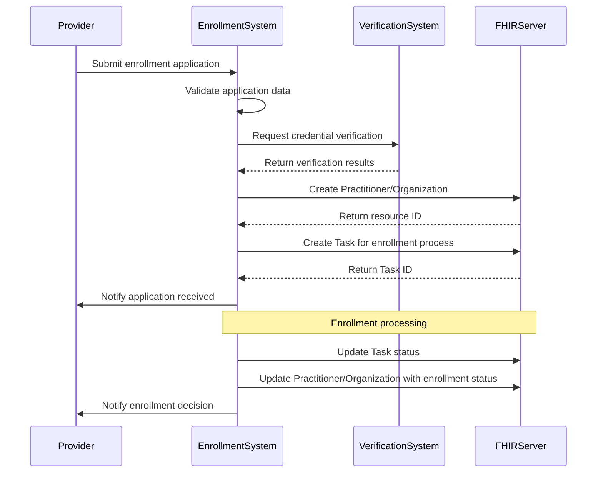
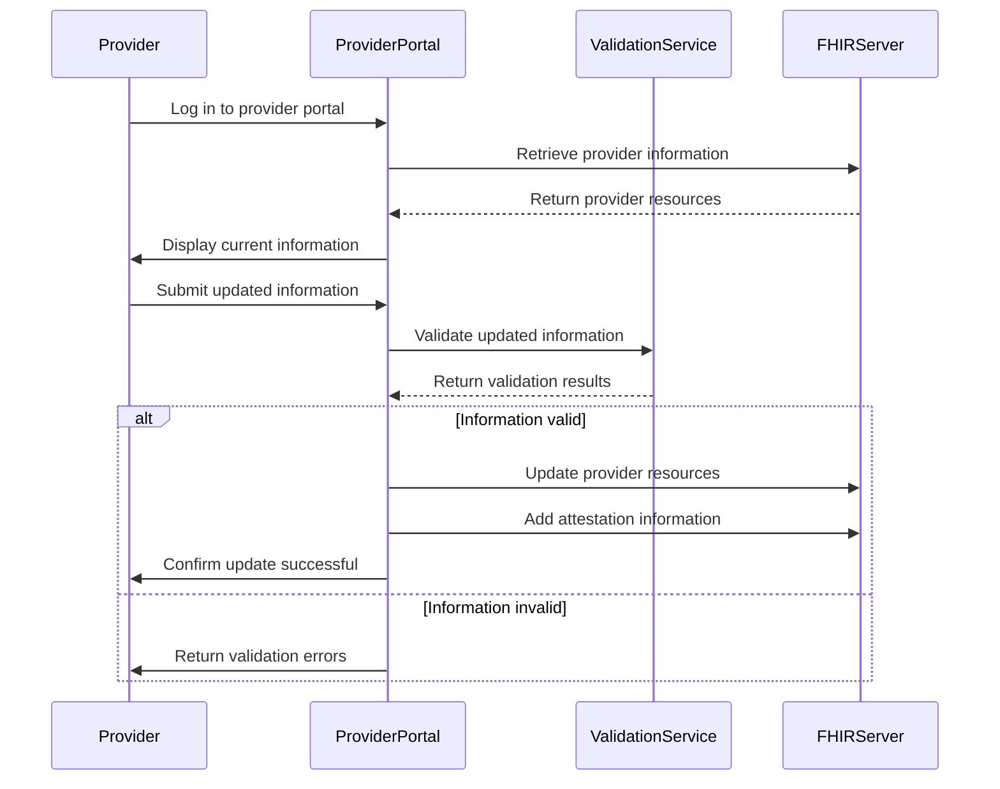
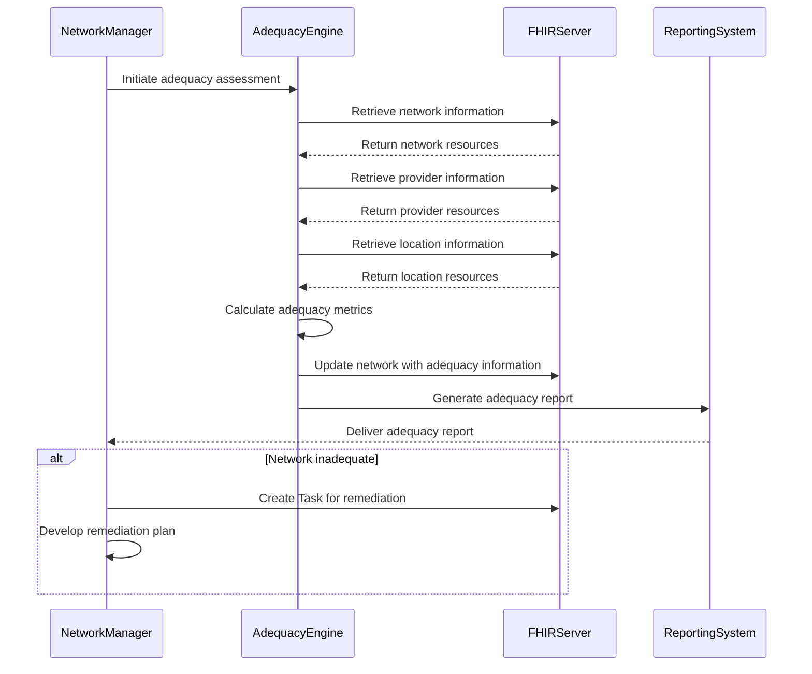

### Overview

This Implementation Guide (IG) provides guidance for implementing provider directory functionality in alignment with the Medicaid Information Technology Architecture (MITA) 3.0 business processes [1]. This guidance is intended to help state Medicaid agencies and their technology partners implement FHIR-based provider directories that support MITA business processes while meeting federal requirements for interoperability [2].

### MITA Business Processes

The MITA framework defines several business processes related to provider management [3]. This IG focuses on the following key business processes:

#### PM01 - Provider Enrollment

The Provider Enrollment business process encompasses the activities of enrolling providers to deliver services to Medicaid members [4]. This includes:

- **Receiving and processing provider applications** - The systematic intake and review of applications from healthcare providers seeking to participate in the Medicaid program, including verification of application completeness, initial data validation, and tracking of application status throughout the enrollment workflow.

- **Validating provider credentials** - The comprehensive verification of a provider's qualifications, licenses, certifications, education, training, and practice history to ensure they meet Medicaid program requirements and maintain appropriate credentials to deliver specific healthcare services to beneficiaries.

- **Assigning provider identifiers** - The generation and assignment of unique identification numbers that distinguish providers within the Medicaid system, enabling accurate tracking, claims processing, and data management throughout the provider's relationship with the Medicaid program.

- **Executing provider agreements** - The formal establishment of contractual relationships between providers and the Medicaid program, including documentation of terms, conditions, obligations, reimbursement arrangements, and compliance requirements that govern the provider's participation.

- **Notifying providers of enrollment decisions** - The timely communication of enrollment status determinations to applicants, including approvals, denials, requests for additional information, and explanations of appeal rights when applicable.

##### FHIR Resources for Provider Enrollment

The following FHIR resources support the Provider Enrollment business process:

| MITA Data Concept | FHIR Resource | Profile | Notes |
|-------------------|---------------|---------|-------|
| Provider Application | Task | | Use Task to track the enrollment application process |
| Provider Demographics | Practitioner, Organization | MedicaidPractitioner, MedicaidOrganization | Basic demographic information about the provider |
| Provider Credentials | Practitioner.qualification | MedicaidPractitioner | Credentials and qualifications of individual providers |
| Provider Identifier | Identifier | | Identifiers assigned to providers, including the MedicaidProviderIdentifier extension |
| Provider Agreement | Contract | | Use Contract to represent the agreement between the provider and Medicaid |
| Enrollment Status | Extension | MedicaidEnrollmentStatus | Status of the provider's enrollment |
| Enrollment Date | Extension | MedicaidEnrollmentDate | Date of the provider's enrollment |

##### Implementation Guidance for Provider Enrollment

1. **Application Tracking**:
   - Use Task resources to track the progress of provider enrollment applications through each stage of the process, from initial submission to final determination, enabling real-time visibility into application status and identifying bottlenecks in the enrollment workflow.
   - Define task statuses that align with your state's enrollment workflow, such as "received," "under review," "pending additional information," "in credentialing," "in background check," "awaiting approval," and "completed," to accurately reflect the application's current stage.
   - Link tasks to the relevant provider resources (Practitioner, Organization) to maintain relationships between the application process and the provider entities, facilitating comprehensive tracking and reporting.

2. **Provider Demographics**:
   - Use MedicaidPractitioner and MedicaidOrganization profiles to capture provider demographics in a standardized format that aligns with FHIR specifications while accommodating Medicaid-specific requirements for provider information.
   - Ensure all required data elements are collected during the enrollment process, including name, contact information, practice locations, languages spoken, accessibility features, and other details that help beneficiaries identify appropriate providers.
   - Validate addresses and other contact information against authoritative sources such as the USPS database to ensure accuracy and standardization, reducing returned mail and improving communication reliability.

3. **Credential Verification**:
   - Use Practitioner.qualification to capture credential information including licenses, certifications, specialties, and educational background, providing a comprehensive view of the provider's qualifications to deliver specific healthcare services.
   - Document the verification process using the VerificationInformation extension to record verification sources, methods, dates, and outcomes, creating an audit trail that demonstrates due diligence in credential validation.
   - Link to external credential verification systems where possible, such as state licensing boards, the National Practitioner Data Bank, and specialty certification boards, to streamline verification and ensure credential information remains current.

4. **Provider Agreements**:
   - Use Contract resources to represent provider agreements, capturing the formal relationship between the provider and the Medicaid program, including effective dates, termination conditions, and renewal terms.
   - Link contracts to the relevant provider resources to maintain relationships between agreements and the providers they govern, enabling comprehensive tracking of contractual relationships.
   - Include key terms and conditions in the contract resource, such as service obligations, quality requirements, reporting responsibilities, and reimbursement arrangements, to document the complete agreement in a structured format.

5. **Enrollment Status Management**:
   - Use the MedicaidEnrollmentStatus extension to track enrollment status throughout the provider's relationship with the Medicaid program, providing visibility into current participation status and historical changes.
   - Implement workflows for status changes (e.g., pending to active, active to suspended) that include appropriate reviews, approvals, and notifications to ensure proper governance of status transitions.
   - Ensure status changes are properly documented and communicated to all stakeholders, including the provider, Medicaid staff, managed care organizations, and other systems that rely on provider enrollment status information.

#### PM02 - Provider Information Management

The Provider Information Management business process encompasses the activities of maintaining accurate provider information [4]. This includes:

- **Updating provider demographics** - The ongoing process of collecting, validating, and storing current personal and professional information about providers, including contact details, practice information, languages spoken, and other characteristics that help beneficiaries identify and connect with appropriate providers.

- **Managing provider credentials** - The continuous monitoring, verification, and documentation of provider qualifications, including tracking license renewals, certification expirations, continuing education requirements, and other credential-related activities to ensure providers maintain appropriate qualifications throughout their participation in Medicaid.

- **Tracking provider relationships** - The documentation and maintenance of associations between providers and organizations, including employment relationships, hospital privileges, group practice affiliations, and network participation, creating a comprehensive view of how providers are connected within the healthcare ecosystem.

- **Maintaining provider service information** - The ongoing curation of detailed information about the specific healthcare services offered by providers, including specialties, procedures, populations served, and service limitations, enabling beneficiaries to identify providers who can meet their specific healthcare needs.

- **Handling provider status changes** - The systematic processing of modifications to a provider's participation status, including temporary suspensions, terminations, leaves of absence, and reinstatements, ensuring that all systems and stakeholders have accurate information about provider availability.

##### FHIR Resources for Provider Information Management

The following FHIR resources support the Provider Information Management business process:

| MITA Data Concept | FHIR Resource | Profile | Notes |
|-------------------|---------------|---------|-------|
| Provider Demographics | Practitioner, Organization | MedicaidPractitioner, MedicaidOrganization | Basic demographic information about the provider |
| Provider Credentials | Practitioner.qualification | MedicaidPractitioner | Credentials and qualifications of individual providers |
| Provider Relationships | PractitionerRole, OrganizationAffiliation | MedicaidPractitionerRole, MedicaidOrganizationAffiliation | Relationships between providers and organizations |
| Provider Services | HealthcareService | MedicaidHealthcareService | Services offered by the provider |
| Provider Locations | Location | MedicaidLocation | Locations where services are provided |
| Provider Status | active flag, Extension | MedicaidEnrollmentStatus | Status of the provider |

##### Implementation Guidance for Provider Information Management

1. **Information Update Workflows**:
   - Implement workflows for providers to update their information through self-service portals, administrative interfaces, and batch processes, offering multiple channels to maintain current provider data while minimizing administrative burden.
   - Use the AttestationInformation extension to document provider attestation of information accuracy, including the date of attestation, the attesting individual, and the method of attestation, creating an audit trail of provider-confirmed data.
   - Implement validation checks for updated information to ensure data quality, including format validation, cross-field consistency checks, and verification against authoritative sources where appropriate.

2. **Credential Management**:
   - Implement processes for tracking credential expiration dates across all provider types, specialties, and jurisdictions, with configurable rules for different credential types and their renewal requirements.
   - Send notifications for upcoming credential expirations to providers, administrators, and other stakeholders at defined intervals (e.g., 90, 60, 30 days before expiration), ensuring timely renewal and preventing lapses in credentials.
   - Document credential verification using the VerificationInformation extension to record the verification source, method, date, and outcome for each credential, creating a comprehensive audit trail of credential validation activities.

3. **Relationship Management**:
   - Use MedicaidPractitionerRole and MedicaidOrganizationAffiliation to manage relationships between individual providers, organizations, networks, and locations, creating a complete picture of how providers are connected within the healthcare ecosystem.
   - Ensure relationships have appropriate start and end dates to accurately reflect the timeline of affiliations, enabling point-in-time queries about provider relationships and supporting historical analysis.
   - Validate that relationships are consistent (e.g., a practitioner cannot be affiliated with an inactive organization) through automated business rules that check for logical contradictions and temporal inconsistencies in relationship data.

4. **Service Information Management**:
   - Use MedicaidHealthcareService to manage service information including specialties, procedures, populations served, and service limitations, providing detailed information about the specific healthcare services available to beneficiaries.
   - Link services to the appropriate locations and providers to create a comprehensive view of where and by whom services are provided, enabling location-based service discovery for beneficiaries.
   - Ensure service information is up-to-date and accurate through regular review cycles, automated notifications for information that hasn't been confirmed recently, and integration with credentialing and privileging systems.

5. **Location Management**:
   - Use MedicaidLocation to manage provider locations including practice sites, telehealth capabilities, service delivery settings, and accessibility features, providing comprehensive information about where and how services are delivered.
   - Validate addresses and other location information against authoritative sources such as the USPS database, geocoding services, and physical site visits where appropriate, ensuring location data accuracy.
   - Link locations to the appropriate organizations and services to create a complete picture of the healthcare delivery infrastructure, enabling beneficiaries to find services at convenient locations.

6. **Status Management**:
   - Implement workflows for status changes that include appropriate reviews, approvals, and notifications based on the type of status change and its potential impact on beneficiary access to care.
   - Ensure status changes are properly documented and communicated to all stakeholders, including the provider, Medicaid staff, managed care organizations, and beneficiaries who may be affected by the change.
   - Update related resources when a provider's status changes to maintain consistency across the provider directory, including updating relationships, service availability, and network participation based on the new status.

#### PM08 - Provider Network Management

The Provider Network Management business process encompasses the activities of developing and maintaining the provider network [4]. This includes:

- **Managing network composition** - The strategic development and ongoing maintenance of a diverse provider network that meets beneficiary needs, including recruiting providers with specific specialties, managing provider participation across geographic areas, and ensuring appropriate representation of provider types to deliver comprehensive care.

- **Assessing network adequacy** - The systematic evaluation of whether the provider network meets established standards for beneficiary access to care, including analyzing provider-to-beneficiary ratios, geographic distribution of providers, appointment availability, and other metrics that measure beneficiaries' ability to access needed services.

- **Monitoring network performance** - The continuous tracking and analysis of provider network effectiveness, including measuring quality of care, beneficiary satisfaction, utilization patterns, and cost efficiency to identify opportunities for improvement and ensure the network delivers high-quality, cost-effective care.

- **Managing provider contracts** - The administration of contractual relationships between the Medicaid program or managed care organizations and network providers, including negotiating terms, processing contract renewals, implementing contract amendments, and ensuring compliance with contractual obligations.

- **Handling network changes** - The systematic processing of modifications to the provider network, including provider additions and terminations, service area expansions or reductions, and changes to network requirements, ensuring that changes are properly documented, communicated, and evaluated for their impact on beneficiary access to care.

##### FHIR Resources for Provider Network Management

The following FHIR resources support the Provider Network Management business process:

| MITA Data Concept | FHIR Resource | Profile | Notes |
|-------------------|---------------|---------|-------|
| Network | Organization | MedicaidNetwork | Represents a provider network |
| Network Composition | OrganizationAffiliation | MedicaidOrganizationAffiliation | Affiliations between providers and networks |
| Network Adequacy | Extension | MedicaidNetworkAdequacy | Metrics related to network adequacy |
| Network Type | Extension | MedicaidNetworkType | Type of network (e.g., managed care, fee-for-service) |
| Service Area | Extension | MedicaidServiceArea | Geographic area covered by the network |
| Provider Contracts | Contract | | Contracts between providers and networks |

##### Implementation Guidance for Provider Network Management

1. **Network Definition**:
   - Use MedicaidNetwork to define provider networks with clear identification, purpose, and scope, enabling the representation of different network types such as managed care plans, specialty networks, and primary care networks within the Medicaid ecosystem.
   - Specify network types using the MedicaidNetworkType extension to categorize networks according to their purpose, structure, and operational model (e.g., managed care, fee-for-service, specialty, dental, behavioral health), facilitating appropriate network selection for beneficiaries.
   - Define service areas using the MedicaidServiceArea extension to specify the geographic regions covered by each network, including counties, zip codes, or other geographic designations that determine where beneficiaries can access network services.

2. **Network Composition Management**:
   - Use MedicaidOrganizationAffiliation to manage network affiliations between providers and networks, documenting the formal relationships that establish which providers participate in which networks and under what terms.
   - Ensure affiliations have appropriate start and end dates to accurately reflect the timeline of network participation, enabling point-in-time queries about network composition and supporting historical analysis of network changes.
   - Track changes to network composition over time through versioning and history mechanisms, creating an audit trail of network evolution that supports trend analysis, compliance reporting, and historical reference.

3. **Network Adequacy Assessment**:
   - Use the MedicaidNetworkAdequacy extension to capture adequacy metrics such as provider-to-beneficiary ratios, time/distance standards, appointment availability, and other measures that quantify beneficiaries' ability to access care within the network.
   - Implement processes for regular adequacy assessments on defined schedules (e.g., quarterly, annually) and in response to significant network changes, ensuring ongoing compliance with state and federal network adequacy requirements.
   - Document adequacy evaluation results and remediation plans when deficiencies are identified, including specific actions, timelines, and responsible parties for addressing gaps in network coverage or accessibility.

4. **Contract Management**:
   - Use Contract resources to manage provider contracts, capturing key terms, conditions, reimbursement arrangements, and performance expectations that govern the relationship between providers and the network.
   - Link contracts to the relevant providers and networks to maintain relationships between contractual documents and the entities they govern, enabling comprehensive tracking of contractual relationships across the provider ecosystem.
   - Track contract terms, renewal dates, and status through structured data elements and automated notifications, ensuring timely contract management activities and preventing unintended contract lapses or expirations.

5. **Network Change Management**:
   - Implement workflows for handling network changes that include appropriate reviews, approvals, and notifications based on the type of change and its potential impact on beneficiary access to care.
   - Ensure changes are properly documented and communicated to all stakeholders, including providers, Medicaid staff, managed care organizations, and beneficiaries who may be affected by the change.
   - Assess the impact of changes on network adequacy through automated analysis tools that evaluate how proposed changes would affect key adequacy metrics, enabling proactive identification and mitigation of potential access issues before they affect beneficiaries.

### MITA Maturity Model

The MITA Maturity Model defines five levels of maturity for Medicaid systems [5]. This IG supports states in achieving higher levels of maturity for provider directory capabilities.

#### Level 1 - As-Is

At Level 1, provider directory processes are largely manual and paper-based. Data is stored in siloed systems with limited automation and interoperability.

#### Level 2 - Transition

At Level 2, provider directory processes are partially automated, but still rely on manual intervention. Data is stored in electronic systems, but interoperability is limited.

##### Implementation Guidance for Level 2

1. **Electronic Data Storage**:
   - Implement a basic FHIR server to store provider directory data, transitioning from paper-based or legacy electronic systems to a standards-based platform that can serve as the foundation for future interoperability enhancements.
   - Define basic profiles for core resources (Practitioner, Organization, Location) that capture essential provider information while maintaining compatibility with FHIR standards, enabling a gradual transition to more comprehensive data models.
   - Implement basic search capabilities that allow users to find providers based on common criteria such as name, specialty, and location, improving the usability of the directory while preparing for more advanced search functionality.

2. **Basic Automation**:
   - Automate simple workflows (e.g., data validation, notification generation) to reduce manual effort and improve data quality, focusing on high-volume processes that offer significant efficiency gains with relatively straightforward implementation.
   - Implement basic reporting capabilities that provide insights into provider demographics, credential status, and network composition, enabling data-driven decision making while establishing the foundation for more advanced analytics.
   - Provide a simple user interface for data entry and retrieval that improves upon paper-based processes, focusing on usability for administrative staff while planning for more comprehensive interfaces in future maturity levels.

#### Level 3 - To-Be

At Level 3, provider directory processes are largely automated and standardized. Data is stored in interoperable systems that support standards-based exchange.

##### Implementation Guidance for Level 3

1. **Standards-Based Interoperability**:
   - Implement the full set of profiles defined in this IG to ensure comprehensive representation of provider directory information in a standardized format, enabling seamless data exchange with other systems that conform to the same standards.
   - Support all required search parameters to enable sophisticated querying of provider directory data, allowing users to find providers based on complex criteria such as specialty, network participation, accessibility features, and geographic proximity.
   - Implement RESTful APIs for data exchange that follow FHIR specifications, enabling other systems to programmatically access and update provider directory information through standardized interfaces that support the full range of CRUD operations.

2. **Advanced Automation**:
   - Automate complex workflows (e.g., credential verification, network adequacy assessment) that involve multiple steps, decision points, and external system interactions, reducing manual effort while improving consistency and timeliness of critical provider management processes.
   - Implement advanced reporting and analytics capabilities that provide insights into provider network composition, adequacy, and performance, enabling data-driven decision making and proactive management of provider networks.
   - Provide a comprehensive user interface for data management that supports all provider directory functions, offering role-based views and capabilities tailored to different user types such as providers, administrators, and consumers.

3. **Data Quality Management**:
   - Implement the data quality framework defined in this IG, establishing clear standards, processes, and governance for ensuring the accuracy, completeness, and timeliness of provider directory information.
   - Automate data validation and verification processes that check provider information against authoritative sources, apply business rules to detect inconsistencies, and flag potential data quality issues for review and resolution.
   - Monitor and report on data quality metrics such as completeness, currency, and accuracy, providing visibility into the overall health of the provider directory and identifying areas for targeted improvement efforts.

#### Level 4 - Enhanced

At Level 4, provider directory processes are fully automated and integrated with other systems. Data is exchanged seamlessly across the healthcare ecosystem.

##### Implementation Guidance for Level 4

1. **Advanced Interoperability**:
   - Implement FHIR-based APIs for real-time data exchange that support immediate updates and queries across systems, enabling provider directory information to flow seamlessly between Medicaid systems, provider organizations, health information exchanges, and consumer applications.
   - Support subscription-based notifications for data changes that allow interested systems and stakeholders to receive immediate updates when provider information changes, ensuring all connected systems maintain synchronized and current provider data.
   - Integrate with other healthcare systems (e.g., claims, clinical) to create a comprehensive view of the healthcare ecosystem, enabling advanced analytics that combine provider directory information with utilization, quality, and clinical data to drive improvements in care delivery and network management.

2. **Predictive Analytics**:
   - Implement predictive models for network adequacy that forecast potential gaps in provider coverage based on population trends, provider retirement patterns, and service utilization changes, enabling proactive network development before access issues emerge.
   - Use analytics to identify potential data quality issues by detecting anomalies, inconsistencies, and patterns that suggest inaccurate or outdated information, allowing for targeted data quality improvement efforts.
   - Provide decision support for network management that recommends specific actions to address network gaps, improve provider performance, and enhance beneficiary access to care, based on comprehensive analysis of provider directory data and related healthcare information.

3. **Consumer Engagement**:
   - Provide consumer-facing provider directory applications that offer intuitive, accessible interfaces for beneficiaries to find providers who meet their specific needs, available across multiple platforms including web, mobile, and voice-activated devices.
   - Support advanced search and filtering capabilities that allow beneficiaries to find providers based on complex criteria such as specialty, languages spoken, accessibility features, network participation, quality ratings, and appointment availability.
   - Enable consumer feedback on provider information through ratings, reviews, and error reporting mechanisms, creating a continuous improvement loop where beneficiary experiences help enhance the accuracy and usefulness of provider directory information.

#### Level 5 - Optimized

At Level 5, provider directory processes are continuously optimized and improved. Data is of the highest quality and is used to drive strategic decision-making.

##### Implementation Guidance for Level 5

1. **Continuous Improvement**:
   - Implement processes for continuous monitoring and improvement of provider directory systems and data, including automated quality checks, regular user feedback collection, performance monitoring, and systematic review of operational metrics to identify opportunities for enhancement.
   - Use feedback loops to enhance data quality and usability by systematically collecting, analyzing, and acting upon input from all stakeholders including providers, beneficiaries, administrators, and connected systems, creating a learning system that constantly evolves to better meet user needs.
   - Regularly update standards and processes based on best practices, emerging technologies, regulatory changes, and industry innovations, ensuring the provider directory remains at the forefront of healthcare information management and continues to deliver maximum value to all stakeholders.

2. **Strategic Decision Support**:
   - Provide advanced analytics for strategic planning that transform provider directory data into actionable insights about network composition, provider availability, service coverage, and market dynamics, enabling Medicaid agencies to make informed decisions about program design and resource allocation.
   - Support scenario modeling for network changes that allows administrators to simulate the impact of potential modifications to provider networks, such as adding or removing providers, changing service areas, or implementing new network requirements, before making actual changes.
   - Enable data-driven decision-making for program management by integrating provider directory information with other data sources such as claims, clinical outcomes, social determinants of health, and beneficiary feedback, creating a comprehensive view of program performance and opportunities for improvement.

3. **Ecosystem Integration**:
   - Participate in health information exchanges by sharing provider directory information with regional and national HIEs, contributing to a more connected healthcare ecosystem where accurate provider information flows seamlessly across organizational boundaries.
   - Contribute to national provider directories by sharing standardized provider data with federal initiatives such as the National Plan and Provider Enumeration System (NPPES) and emerging national directory efforts, reducing duplication of effort and improving overall provider directory accuracy nationwide.
   - Support cross-state provider data exchange through standardized interfaces and data models that enable seamless sharing of provider information across state lines, facilitating care coordination for beneficiaries who receive services in multiple states and reducing administrative burden for providers who practice in multiple jurisdictions.

### Implementation Patterns

#### Provider Enrollment Pattern

The following sequence diagram illustrates a typical provider enrollment workflow:

#### Provider Information Update Pattern

The following sequence diagram illustrates a typical provider information update workflow:

#### Network Adequacy Assessment Pattern

The following sequence diagram illustrates a typical network adequacy assessment workflow:

### Security and Privacy Considerations

#### Authentication and Authorization

Provider directory systems should implement appropriate authentication and authorization mechanisms to ensure that only authorized users can access and modify provider information [6]. This IG recommends the following approach:

1. **Authentication**:
   - Implement strong authentication mechanisms (e.g., multi-factor authentication) that require users to verify their identity through multiple verification methods such as passwords, security tokens, biometrics, or one-time codes, significantly reducing the risk of unauthorized access due to credential compromise.
   - Use industry-standard protocols (e.g., OAuth 2.0, OpenID Connect) that provide secure, standardized approaches to authentication and identity management, enabling integration with enterprise identity systems and supporting single sign-on capabilities across multiple applications.
   - Regularly audit authentication logs to identify suspicious access patterns, failed login attempts, and other security anomalies that might indicate attempted unauthorized access, ensuring prompt investigation and response to potential security incidents.

2. **Authorization**:
   - Implement role-based access control that assigns permissions based on user roles (e.g., provider, administrator, consumer, system integrator), ensuring users have access only to the functionality and data necessary for their specific responsibilities and preventing unauthorized actions.
   - Define granular permissions for different types of users that control specific actions (read, write, update, delete) on specific resource types and instances, allowing precise control over who can perform which operations on which provider directory information.
   - Regularly review and update access controls to ensure they remain aligned with current organizational structures, job responsibilities, and security requirements, removing unnecessary access privileges and adjusting permissions as roles and responsibilities change.

#### Data Protection

Provider directory systems should implement appropriate data protection mechanisms to ensure the confidentiality and integrity of provider information [6]. This IG recommends the following approach:

1. **Data Encryption**:
   - Encrypt data in transit using TLS (Transport Layer Security) to protect information as it moves between systems and users, preventing interception and unauthorized access during network transmission and ensuring the confidentiality and integrity of provider data during communication.
   - Encrypt sensitive data at rest using strong encryption for stored provider information, particularly for sensitive data elements such as Social Security Numbers, DEA numbers, and other protected identifiers, ensuring that data remains secure even if storage systems are compromised.
   - Use strong encryption algorithms and key management practices that adhere to current industry standards (e.g., AES-256, RSA-2048), with proper key rotation, secure key storage, and comprehensive key lifecycle management to maintain the security of encrypted data over time.

2. **Data Integrity**:
   - Implement mechanisms to detect unauthorized changes to data such as digital signatures, checksums, and blockchain technologies where appropriate, enabling the system to identify when provider information has been altered without authorization.
   - Maintain audit logs of all data changes that record who changed what information, when the change occurred, and the nature of the change, creating an immutable record of data modifications that supports both security monitoring and regulatory compliance.
   - Regularly validate data integrity through automated processes that check for inconsistencies, corruption, or unauthorized modifications, ensuring that provider directory information remains accurate and trustworthy throughout its lifecycle.

#### Audit Logging

Provider directory systems should implement comprehensive audit logging to track all access to and modifications of provider information [6]. This IG recommends the following approach:

1. **Audit Events**:
   - Log all read and write operations to create a complete record of who accessed what provider information and what changes were made, supporting comprehensive monitoring of system usage and data modifications for security, compliance, and troubleshooting purposes.
   - Log authentication and authorization events including login attempts (successful and failed), logout events, password changes, and permission changes, providing visibility into identity and access management activities that could affect system security.
   - Log system and administrative events such as configuration changes, system startups and shutdowns, backup and restore operations, and other maintenance activities that could impact system availability, performance, or security.

2. **Audit Log Content**:
   - Include timestamp, user identity, action, and affected resources in each log entry to provide complete context about what happened, who performed the action, when it occurred, and which provider directory information was involved.
   - Include source IP address and user agent information to identify the origin and method of access, helping to detect unauthorized access attempts from unexpected locations or using unusual client software.
   - Include success/failure indication for each operation to distinguish between completed actions and attempted but unsuccessful operations, which is particularly important for identifying potential security incidents such as failed login attempts or unauthorized modification attempts.

3. **Audit Log Management**:
   - Protect audit logs from unauthorized access and modification through access controls, encryption, and write-once storage mechanisms where appropriate, ensuring the integrity and trustworthiness of the audit trail even in the event of a security breach.
   - Retain audit logs for an appropriate period based on regulatory requirements, organizational policies, and security best practices, typically ranging from several months to several years depending on the sensitivity of the provider information and applicable compliance frameworks.
   - Regularly review audit logs for suspicious activity using automated monitoring tools that can detect unusual patterns, potential security incidents, and policy violations, enabling prompt investigation and response to security events.

### Testing and Validation

#### Conformance Testing

Provider directory implementations should be tested for conformance to this IG [7]. This IG recommends the following approach:

1. **Profile Validation**:
   - Validate resources against the profiles defined in this IG to ensure that all provider directory resources conform to the specified data structures, constraints, and terminology bindings, guaranteeing consistent implementation across different Medicaid systems.
   - Use the FHIR Validator or other validation tools that can automatically check resources against profile definitions, providing detailed feedback on conformance issues and enabling efficient identification and resolution of structural problems.
   - Address all validation errors and warnings through systematic review and correction, prioritizing errors that affect interoperability and data integrity while documenting any intentional deviations with clear justification.

2. **Search Parameter Testing**:
   - Test all required search parameters to ensure they return appropriate results according to the specifications, verifying that each parameter correctly filters resources based on the defined criteria and supports the expected use cases.
   - Verify that search results are correct and complete by comparing them against known data sets, ensuring that searches return all matching resources without inappropriate omissions or inclusions.
   - Test complex search scenarios (e.g., combinations of parameters) that reflect real-world usage patterns, including edge cases such as partial matches, special characters, and boundary conditions to ensure robust search functionality.

3. **Extension Validation**:
   - Validate that extensions are used correctly according to their definitions, ensuring that Medicaid-specific extensions such as MedicaidEnrollmentStatus, MedicaidNetworkAdequacy, and MedicaidProviderIdentifier are implemented consistently across resources.
   - Verify that extension values conform to the defined value sets by checking against authoritative terminology sources, ensuring semantic consistency and preventing the use of invalid or deprecated codes.
   - Test extension-based search parameters to confirm that extensions can be effectively used in queries, enabling users to find resources based on Medicaid-specific attributes that are represented as extensions.

#### Functional Testing

Provider directory implementations should be tested for functional correctness. This IG recommends the following approach:

1. **Workflow Testing**:
   - Test end-to-end workflows (e.g., provider enrollment, information update) that simulate real-world business processes, ensuring that the provider directory system supports the complete sequence of activities required to accomplish common tasks.
   - Verify that all steps in the workflow function correctly, including transitions between steps, data persistence between stages, notification generation, and appropriate user feedback throughout the process.
   - Test error handling and edge cases such as incomplete data, validation failures, timeouts, and concurrent operations to ensure the system responds appropriately to exceptional conditions and maintains data integrity even when workflows don't follow the happy path.

2. **Integration Testing**:
   - Test integration with other systems (e.g., enrollment, credentialing) to verify that the provider directory can exchange data with external systems through defined interfaces, supporting the broader ecosystem of Medicaid information systems.
   - Verify that data flows correctly between systems in both directions, maintaining semantic consistency and structural integrity as information moves across system boundaries and is transformed between different data models.
   - Test error handling and recovery mechanisms for integration scenarios, including handling of network failures, version mismatches, authentication issues, and data validation errors, ensuring robust operation in a distributed environment.

3. **Performance Testing**:
   - Test system performance under expected load conditions that simulate typical usage patterns, including peak periods and routine operations, to ensure the system can handle the anticipated volume of transactions without degradation.
   - Verify that response times meet requirements for different types of operations and user interfaces, ensuring that the system provides acceptable performance for both interactive user sessions and automated system interactions.
   - Test system scalability by gradually increasing load beyond normal levels to identify performance bottlenecks, resource constraints, and breaking points, informing capacity planning and architectural improvements to support future growth.

#### User Acceptance Testing

Provider directory implementations should be tested for usability and acceptance by end users. This IG recommends the following approach:

1. **Provider Testing**:
   - Test with representative providers from different specialties, practice types, and technical backgrounds to ensure the system meets the needs of the diverse provider community that will use it to maintain their information.
   - Verify that providers can easily update their information through intuitive interfaces that minimize administrative burden, support efficient data entry, and provide clear guidance on information requirements and validation rules.
   - Collect feedback on usability and functionality through structured evaluations, observation sessions, and satisfaction surveys, using this input to identify pain points, prioritize enhancements, and refine the provider experience.

2. **Consumer Testing**:
   - Test with representative consumers of varying ages, abilities, technical proficiency, and healthcare needs to ensure the directory is accessible and useful for the diverse Medicaid beneficiary population.
   - Verify that consumers can easily find providers who meet their specific needs through intuitive search interfaces, clear presentation of provider information, and helpful filtering and sorting capabilities.
   - Collect feedback on usability and functionality through user observation, task completion metrics, and satisfaction ratings to identify barriers to effective use and opportunities to enhance the consumer experience.

3. **Administrator Testing**:
   - Test with representative administrators who perform different roles in managing the provider directory, including data stewards, network managers, compliance officers, and technical support staff.
   - Verify that administrators can effectively manage the directory through comprehensive administrative interfaces that support data quality monitoring, issue resolution, reporting, and system configuration.
   - Collect feedback on usability and functionality through structured evaluation sessions that assess the efficiency and effectiveness of administrative workflows, identifying opportunities to streamline operations and enhance administrative capabilities.

### Implementation Timeline

The following timeline provides a suggested approach for implementing a FHIR-based provider directory in alignment with MITA:

#### Phase 1: Planning and Requirements (3-6 months)

1. **Assess Current State**:
   - Document current provider directory processes through comprehensive workflow analysis, stakeholder interviews, and system inventory, creating a detailed understanding of existing operations, data flows, and system interactions.
   - Identify pain points and opportunities for improvement by analyzing data quality issues, process inefficiencies, user feedback, and compliance gaps, prioritizing areas that would deliver the greatest value through modernization.
   - Determine MITA maturity level using the MITA Self-Assessment Framework to establish a baseline for the current provider directory capabilities, identifying specific areas where the implementation should focus to advance maturity.

2. **Define Requirements**:
   - Identify business requirements through stakeholder engagement sessions with providers, beneficiaries, administrators, and other users, documenting functional needs, operational constraints, and policy mandates that the provider directory must address.
   - Define technical requirements including interoperability standards, security controls, performance metrics, and system integration points, ensuring alignment with both MITA technical architecture and FHIR implementation guidelines.
   - Establish success criteria with measurable objectives for data quality, system performance, user satisfaction, and business process improvement, creating a clear framework for evaluating the implementation's effectiveness.

3. **Develop Implementation Plan**:
   - Define project scope and timeline with clear phases, milestones, and deliverables, creating a realistic roadmap that balances the need for rapid progress with the complexity of implementation and organizational constraints.
   - Identify resources and dependencies including staffing needs, technical infrastructure, external systems integration, and organizational change management requirements, ensuring all necessary components are accounted for in the plan.
   - Develop risk management plan that identifies potential obstacles, technical challenges, and organizational barriers, with specific mitigation strategies and contingency plans to address risks throughout the implementation lifecycle.

#### Phase 2: Core Implementation (6-12 months)

1. **Implement Core Infrastructure**:
   - Set up FHIR server with appropriate configuration for Medicaid provider directory use cases, including server settings, resource validation, terminology support, and search optimization to create a solid foundation for the provider directory.
   - Implement authentication and authorization mechanisms that align with organizational security policies and regulatory requirements, ensuring appropriate access controls while supporting the diverse user base that will interact with the provider directory.
   - Establish development, test, and production environments with appropriate data segregation, deployment pipelines, and operational procedures, creating a robust infrastructure that supports the full software development lifecycle.

2. **Implement Core Resources**:
   - Implement Practitioner and Organization profiles that capture essential provider information according to the specifications in this IG, focusing on the core demographic and identification data that forms the foundation of the provider directory.
   - Implement Location and HealthcareService profiles to represent where and what services providers offer, enabling the geographic and service-based discovery capabilities that are essential for beneficiary access to care.
   - Implement basic search capabilities that allow users to find providers by common criteria such as name, specialty, location, and network participation, providing the fundamental query functionality needed for directory usability.

3. **Develop User Interfaces**:
   - Develop provider portal that enables healthcare providers to view and update their information through an intuitive, secure interface, reducing administrative burden while improving data accuracy through direct provider input.
   - Develop administrative interface for Medicaid staff to manage provider information, monitor data quality, process enrollment applications, and perform other administrative functions through a comprehensive management console.
   - Develop consumer-facing directory that allows beneficiaries to search for providers based on their specific needs, presenting provider information in a clear, accessible format that supports informed healthcare decisions.

#### Phase 3: Advanced Implementation (6-12 months)

1. **Implement Advanced Resources**:
   - Implement PractitionerRole and OrganizationAffiliation profiles to represent the complex relationships between providers, organizations, and networks, enabling a comprehensive view of how providers are connected within the healthcare ecosystem.
   - Implement Network and Endpoint profiles to support network adequacy assessment and digital connectivity information, providing the structural foundation for managing provider networks and electronic service delivery.
   - Implement advanced search capabilities including geographic search, filtered queries, and relationship-based searches that enable sophisticated provider discovery based on complex criteria and relationships between resources.

2. **Implement Workflows**:
   - Implement provider enrollment workflow that guides providers through the application process, supports credential verification, and manages the progression from application to active enrollment, automating a previously manual and paper-intensive process.
   - Implement information update workflow that enables efficient maintenance of provider information through attestation, validation, and approval processes, ensuring that directory information remains current and accurate over time.
   - Implement network management workflow that supports network composition analysis, adequacy assessment, and change management, enabling effective oversight and optimization of provider networks to meet beneficiary needs.

3. **Implement Data Quality Framework**:
   - Implement attestation and verification processes that document the source, validation method, and confidence level for provider information, creating transparency about data provenance and quality.
   - Implement data source documentation that tracks where each data element originated, when it was last updated, and what validation it has undergone, providing a comprehensive audit trail for provider information.
   - Implement data currency monitoring that identifies outdated information, triggers update requests, and tracks attestation frequency, ensuring that provider directory information remains fresh and reliable.

#### Phase 4: Integration and Optimization (6-12 months)

1. **Integrate with Other Systems**:
   - Integrate with enrollment and credentialing systems to establish bidirectional data flows that reduce duplicate data entry, improve data consistency, and streamline the provider onboarding process across multiple systems.
   - Integrate with claims and clinical systems to create connections between provider directory information and healthcare delivery data, enabling analysis of provider availability, service utilization, and care patterns.
   - Integrate with external directories and exchanges including health information exchanges, national provider databases, and other state systems, creating a more connected ecosystem that reduces provider burden and improves directory accuracy.

2. **Implement Advanced Analytics**:
   - Develop reporting and analytics capabilities that transform provider directory data into actionable insights about network composition, provider availability, and service coverage, supporting both operational management and strategic planning.
   - Implement network adequacy assessment tools that analyze provider-to-beneficiary ratios, geographic distribution, appointment availability, and other metrics, enabling compliance monitoring and proactive network management.
   - Implement data quality monitoring dashboards that track completeness, currency, accuracy, and consistency metrics across the provider directory, identifying quality issues and measuring the effectiveness of quality improvement initiatives.

3. **Optimize and Enhance**:
   - Address performance and scalability issues identified through monitoring and testing, implementing technical optimizations such as database tuning, caching strategies, and architectural improvements to ensure the system can support growing usage.
   - Enhance user interfaces based on feedback from providers, beneficiaries, and administrators, refining the user experience to improve usability, accessibility, and effectiveness based on real-world usage patterns and user needs.
   - Implement continuous improvement processes including regular user feedback collection, performance monitoring, and systematic enhancement planning, creating a sustainable approach to ongoing refinement and evolution of the provider directory.

### Conclusion

This implementation guidance provides a framework for implementing provider directory functionality in alignment with MITA business processes. By following this guidance, state Medicaid agencies and their technology partners can implement FHIR-based provider directories that support MITA business processes while meeting federal requirements for interoperability.

The guidance is intended to be flexible and adaptable to the specific needs and constraints of each state Medicaid program. States should tailor the implementation approach to their specific requirements, existing systems, and available resources.

By implementing provider directories in alignment with MITA, states can achieve higher levels of maturity, improve operational efficiency, enhance provider and member experience, and support better healthcare outcomes.

### References

1. Centers for Medicare & Medicaid Services. (2012). *Medicaid Information Technology Architecture (MITA) 3.0 Overview*. Retrieved from https://www.medicaid.gov/medicaid/data-systems/medicaid-information-technology-architecture/index.html

2. Centers for Medicare & Medicaid Services. (2020). *Interoperability and Patient Access Final Rule*. Retrieved from https://www.cms.gov/Regulations-and-Guidance/Guidance/Interoperability/index

3. Centers for Medicare & Medicaid Services. (2012). *MITA 3.0 Part 2: Business Architecture*. Retrieved from https://www.medicaid.gov/medicaid/data-systems/medicaid-information-technology-architecture/medicaid-information-technology-architecture-framework/index.html

4. Centers for Medicare & Medicaid Services. (2018). *MITA Provider Management Business Area*. Retrieved from https://www.medicaid.gov/medicaid/data-systems/medicaid-information-technology-architecture/medicaid-information-technology-architecture-framework/index.html

5. Centers for Medicare & Medicaid Services. (2012). *MITA 3.0 Part 5: Maturity Model*. Retrieved from https://www.medicaid.gov/medicaid/data-systems/medicaid-information-technology-architecture/medicaid-information-technology-architecture-framework/index.html

6. National Institute of Standards and Technology. (2020). *Security and Privacy Controls for Information Systems and Organizations* (NIST Special Publication 800-53, Revision 5). Retrieved from https://csrc.nist.gov/publications/detail/sp/800-53/rev-5/final

7. HL7 International. (2022). *FHIR Implementation Guide Testing and Validation*. Retrieved from https://confluence.hl7.org/display/FHIR/Implementation+Guide+Testing+and+Validation

8. Centers for Medicare & Medicaid Services. (2012). *MITA 3.0 Part 4: Technical Architecture*. Retrieved from https://www.medicaid.gov/medicaid/data-systems/medicaid-information-technology-architecture/medicaid-information-technology-architecture-framework/index.html
