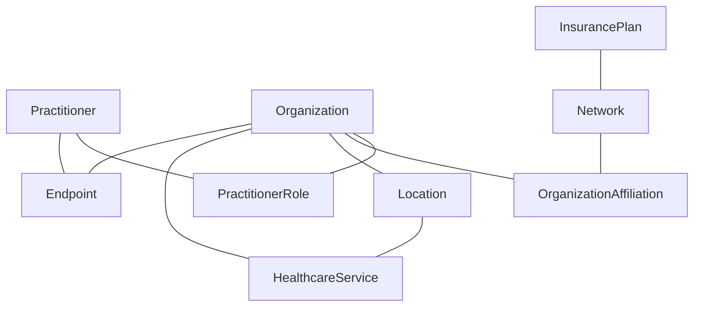

# Provider Directory Resources

## Overview

This Implementation Guide defines a set of FHIR profiles for representing provider directory information in the Medicaid context. These profiles are based on the [Da Vinci Plan-Net Implementation Guide](http://hl7.org/fhir/us/davinci-pdex-plan-net/STU1.1/) and the [FAST National Directory of Healthcare Providers & Services (NDH) Implementation Guide](http://hl7.org/fhir/us/ndh/STU1/), but have been adapted to meet the specific requirements of Medicaid provider directories as defined in the Medicaid Information Technology Architecture (MITA) 3.0 and the CMS Interoperability and Patient Access API Rule.

## Core Resources

The following core resources are used to represent the fundamental entities in a Medicaid provider directory:

### Practitioner

The [Practitioner](StructureDefinition-medicaid-practitioner.html) resource represents an individual healthcare provider who delivers services to Medicaid beneficiaries. This includes physicians, nurses, therapists, and other healthcare professionals.

Key Medicaid-specific extensions and constraints include:
- Medicaid Provider Identifier
- State license verification status
- Medicaid enrollment status and dates
- Provider type codes specific to Medicaid

### Organization

The [Organization](StructureDefinition-medicaid-organization.html) resource represents a group of people or entities that have come together to deliver healthcare services. This includes hospitals, clinics, group practices, and other healthcare organizations.

Key Medicaid-specific extensions and constraints include:
- Medicaid Provider Identifier
- Medicaid facility type codes
- Medicaid enrollment status and dates
- Ownership disclosure information

### Location

The [Location](StructureDefinition-medicaid-location.html) resource represents a physical place where healthcare services are provided. This includes hospitals, clinics, offices, and other service delivery locations.

Key Medicaid-specific extensions and constraints include:
- Accessibility information
- Public transportation access
- Service area coverage
- Medicaid-specific location type codes

## Relationship Resources

The following resources are used to represent relationships between the core entities:

### PractitionerRole

The [PractitionerRole](StructureDefinition-medicaid-practitioner-role.html) resource represents the relationship between a Practitioner and an Organization, including the roles, specialties, and services provided.

Key Medicaid-specific extensions and constraints include:
- Medicaid specialty codes
- Panel status (open/closed to new Medicaid patients)
- Medicaid service categories
- Cultural competency and language capabilities

### OrganizationAffiliation

The [OrganizationAffiliation](StructureDefinition-medicaid-organization-affiliation.html) resource represents relationships between organizations, including network participation and contractual relationships.

Key Medicaid-specific extensions and constraints include:
- Medicaid managed care plan affiliations
- Medicaid contract types and status
- Service authorization requirements
- Payment arrangements

### Network

The [Network](StructureDefinition-medicaid-network.html) resource represents a collection of practitioners and organizations that provide healthcare services under a specific Medicaid program or managed care plan.

Key Medicaid-specific extensions and constraints include:
- Medicaid program type (Traditional, Managed Care, Waiver)
- Network adequacy metrics
- Geographic coverage areas
- Enrollment capacity

## Supporting Resources

The following resources provide additional information to support the provider directory:

### Endpoint

The [Endpoint](StructureDefinition-medicaid-endpoint.html) resource represents electronic service endpoints that can be used to exchange information with the provider or organization.

Key Medicaid-specific extensions and constraints include:
- Medicaid electronic transaction capabilities
- Secure messaging capabilities
- Electronic service types relevant to Medicaid
- Connection requirements

### HealthcareService

The [HealthcareService](StructureDefinition-medicaid-healthcare-service.html) resource represents services provided by practitioners and organizations.

Key Medicaid-specific extensions and constraints include:
- Medicaid covered service categories
- Service authorization requirements
- Eligibility criteria
- Referral requirements

### InsurancePlan

The [InsurancePlan](StructureDefinition-medicaid-insurance-plan.html) resource represents Medicaid plans and programs.

Key Medicaid-specific extensions and constraints include:
- Medicaid program type
- Eligibility criteria
- Enrollment processes
- Coverage details

## Resource Relationships

The following diagram illustrates the relationships between the key resources in this Implementation Guide:

## Medicaid-Specific Extensions

This Implementation Guide defines several Medicaid-specific extensions to capture information that is not covered by the base FHIR resources, the Da Vinci Plan-Net profiles, or the FAST NDH profiles:

### Provider Extensions

- **medicaid-provider-identifier**: A unique identifier assigned to providers by a state Medicaid program
- **medicaid-enrollment-status**: The current enrollment status of a provider in the Medicaid program
- **medicaid-enrollment-date**: The date when a provider was enrolled in the Medicaid program
- **medicaid-provider-type**: The type of provider as defined by the state Medicaid program

### Service Extensions

- **medicaid-service-category**: The category of service as defined by the state Medicaid program
- **medicaid-service-authorization**: Requirements for prior authorization of services
- **medicaid-service-eligibility**: Eligibility criteria for receiving the service

### Network Extensions

- **medicaid-network-type**: The type of Medicaid network (e.g., Fee-for-Service, Managed Care)
- **medicaid-network-adequacy**: Metrics related to network adequacy requirements
- **medicaid-service-area**: The geographic area covered by the network

## Alignment with FAST NDH

This Implementation Guide aligns with the FAST National Directory of Healthcare Providers & Services (NDH) Implementation Guide in the following ways:

### Shared Resources and Profiles

Where appropriate, this IG leverages profiles defined in the NDH IG, particularly for:

- **Verification and Validation**: Incorporating NDH verification extensions and patterns to support Medicaid provider verification processes
- **Accessibility Information**: Using NDH accessibility extensions to document provider accessibility features
- **Electronic Service Information**: Leveraging NDH endpoint profiles for electronic service information
- **Healthcare Services**: Adopting NDH healthcare service patterns for describing Medicaid-covered services

### Enhanced Search Capabilities

This IG incorporates the NDH search parameters and capabilities to enable more robust provider directory queries, including:

- Geospatial search capabilities
- Advanced filtering by provider characteristics
- Network and accessibility-based searches

### Directory Validation

This IG adopts the NDH validation patterns to ensure data quality and currency, including:

- Attestation tracking
- Last verification date tracking
- Data source documentation

## Value Sets

This Implementation Guide defines several value sets to support the Medicaid-specific aspects of provider directories:

- **MedicaidProviderTypeVS**: Types of providers recognized by Medicaid programs, including NUCC Provider Taxonomy codes
- **MedicaidEnrollmentStatusVS**: Possible enrollment statuses for Medicaid providers
- **MedicaidServiceCategoryVS**: Categories of services covered by Medicaid
- **MedicaidNetworkTypeVS**: Types of Medicaid networks
- **MedicaidFacilityTypeVS**: Types of facilities recognized by Medicaid programs, including CMS Place of Service codes

### External Code Systems

In addition to Medicaid-specific code systems, this Implementation Guide leverages established external code systems:

- **NUCC Provider Taxonomy**: Standard provider specialty codes from the National Uniform Claim Committee
- **CMS Place of Service Codes**: Standard facility type codes from the Centers for Medicare & Medicaid Services
- **HCPCS**: Healthcare Common Procedure Coding System for service categories

## Concept Maps

This Implementation Guide provides concept maps to facilitate interoperability between Medicaid-specific codes and industry-standard codes:

- **MedicaidToNUCCProviderTypeMap**: Maps Medicaid provider types to NUCC Provider Taxonomy codes
- **MedicaidToCMSFacilityTypeMap**: Maps Medicaid facility types to CMS Place of Service codes

## Search Parameters

This Implementation Guide defines several search parameters to support finding providers based on Medicaid-specific criteria:

- **medicaid-provider-id**: Search for providers by their Medicaid Provider Identifier
- **medicaid-enrollment-status**: Search for providers by their Medicaid enrollment status
- **medicaid-provider-type**: Search for providers by their Medicaid provider type
- **medicaid-facility-type**: Search for organizations by their Medicaid facility type
- **medicaid-network-type**: Search for providers by the type of Medicaid network they participate in
- **accepting-new-patients**: Search for providers who are accepting new Medicaid patients
